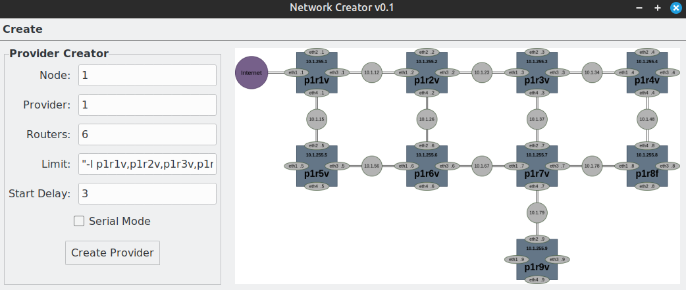
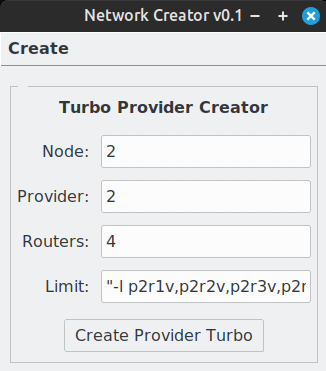
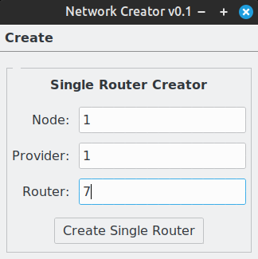
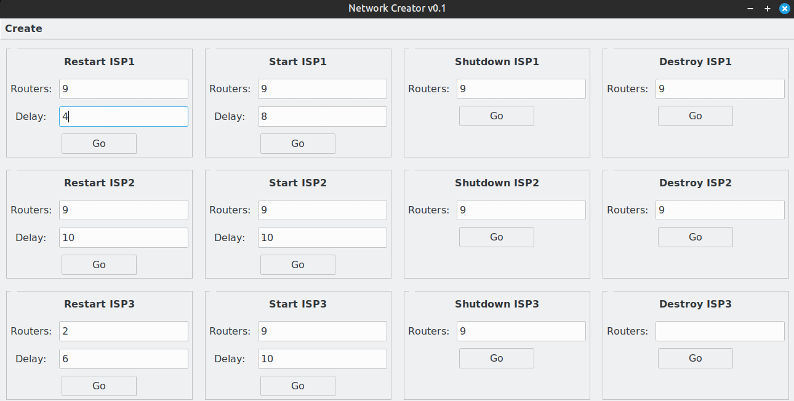

## Verwendungszwecke:

Es geht hier darum, ein Netzwerk von 9 Vyos-Routern automatisiert unter PVE aufzusetzen und mit Ansible zu konfigurieren. Der Network Creator steuert eine abgewandelte Version von [aibix0001 (Gerd's) provider.sh](https://github.com/aibix0001/aasil), die darauf ausgelegt ist, sich bzgl. der Arbeitsgeschwindigkeit an die Gegebenheiten verschieden starker CPU's anzupassen: So gibt es einen Turbomodus für Rechner mit besonders starken CPU's, einen Normalmodus für schwächere CPU's und einen seriellen Modus für besonders schwache CPU's. Um den passenden Modus für die jeweils verwendete CPU zu finden, siehe den Abschnitt 'Erfahrungswerte' im README.pdf. Es ist insbesondere davon abzuraten, den Turbomodus zu verwenden, ohne vorher diesen Abschnitt gelesen zu haben! Im README.pdf wird außerdem beschrieben, wie der Network Creator auf Rechnern mit nur 16 GB verwendet werden kann, sowie eine Menge weiterer Informationen zu seiner Arbeitsweise und Bedienung. Das [Aibix-Projekt](https://www.twitch.tv/aibix0001) wendet sich u.a. an Auszubildende und Studenten im IT-Bereich, sowie weitere Interessierte, die nicht unbedingt immer drei Kraftpakete zur Verfügung haben. Der Network Creator ist deshalb insbesondere auch zur Verwendung mit schwächeren Rechnern entwickelt worden.

## Neueinsteiger

Für alle, die mit den [Streams](https://github.com/aibix0001/streams) von Aibix nicht von Anfang an vertraut sind, gibt es anstatt des Quickstarts das Setup.pdf, in dem der Aufbau des speziellen PVE-Setup's im Einzelnen beschrieben wird, innerhalb dessen der 'streams'-Ordner mit dem Network Creator läuft.

## Spezielle Voraussetzungen:

sudo apt install python3-tk xorg -y

pip3 install ttkthemes

## Quickstart

Nach dem Clonen dieses Repos den Ordner streams aus dem Ordner network_creator_v0.1 herausnehmen und in den Pfad /home/user/streams des PVE-Hosts ablegen und dann von da aus arbeiten.

Der Network Creator wird aufgerufen, indem man 

(1) ein vyos.qcow2 Image erstellt (siehe Setup.pdf) und unter /home/user/streams/create-vms/create-vms-vyos/ ablegt,

(2) eine seed.iso erstellt (siehe Setup.pdf) und unter /var/lib/local-btrfs/template/iso ablegt (dabei nicht vergessen, die SSH-Credentials in der Datei user-data anzupassen),

(3) die neueste Version von Vyos rolling runterläd und unter /home/user/ansible/vyos-files/ ablegt (dazu den Ordner vyos-files anlegen). Diese Datei ab und zu aktualisieren, damit das Updaten überhaupt Sinn macht.

und dann eingibt: 

python3 nwc.py

sudo-Password des Users im Terminal eingeben.

Für alle, deren User nicht user heißt: im create-vm-vyos.sh und im create-vm-vyos-turbo.sh Zeile 33 anpassen. Außerdem sind die SSH-Credentials in den Ansible-Inventories und der Datei user-data beim Erstellen der seed.iso anzupassen, sowie die ansible.cfg .

Um den Network Creator nutzen zu können, braucht man selbstverständlich keine Desktop-Umgebung auf dem PVE zu installieren, sondern es reicht xorg und dann kann man ihn mit ssh -X remote aufrufen. Möglicherweise gibt es Terminals, die ssh -X nicht unterstützen, mit den Gnome-Terminal geht es aber jedenfalls. Ich habe den Network Creator nur unter Linux laufen lassen. Ob er auch unter Windows und Mac verwendbar ist, kann jeder selber probieren, der das möchte. Es sollte eigentlich gehen, da er in Python geschrieben ist.

## Troubleshooting

Die folgenden beiden Arten von Meldungen sind irrelevant und können ignoriert werden:

unable to find configuration file for VM 101003 on node 'node1'
Configuration file 'nodes/node1/qemu-server/101003.conf' does not exist

Diese Meldung besagt, dass eine VM nicht zerstört werden konnte, weil sie nicht existiert.

[WARNING]: Platform linux on host p1r1v is using the discovered Python
interpreter at /usr/bin/python3.11, but future installation of another Python
interpreter could change the meaning of that path. See
https://docs.ansible.com/ansible-
core/2.17/reference_appendices/interpreter_discovery.html for more information.

Diese Meldung ist erklärt sich selbst.

